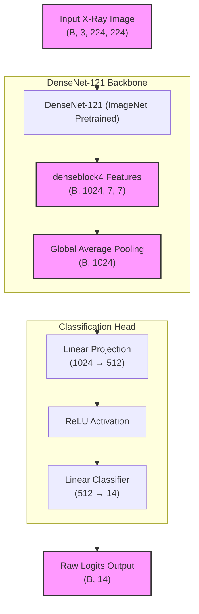
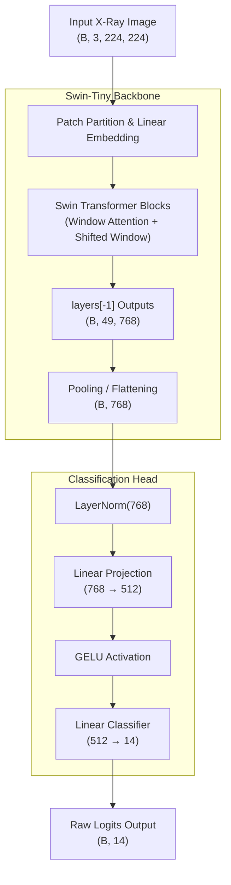
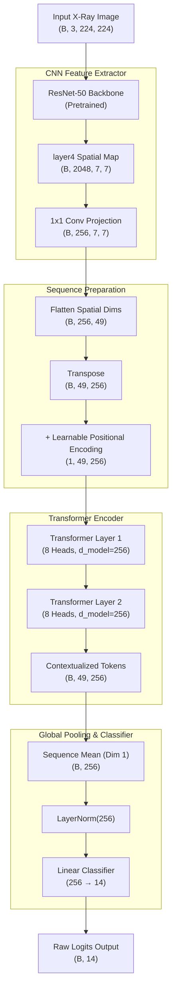
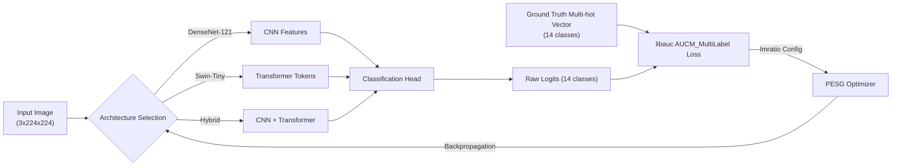

# Multimodal Medical Diagnosis System — Architectural Diagrams

Below are the architectural diagrams detailing the specific neural network structures used in your system. These are particularly useful for the Methodology or Architecture section of an IEEE paper, as they show layer transformations and tensor dimensions.

## 1. DenseNet-121 Classification Architecture
This diagram outlines the architecture of the DenseNet-121 baseline model, including the custom classification head.

## 2. Swin-Tiny Transformer Architecture
This diagram illustrates the Swin Transformer model pipeline, emphasizing the layer normalization and GELU activations in the head.

## 3. CNN-Transformer Hybrid Architecture
This is a detailed architectural view of your custom Hybrid model, showing how spatial features from a CNN are converted into a sequence for the Transformer. This is often the most critical diagram for a paper introducing a novel hybrid approach.

## 4. Overall Multimodal / Multi-label Architecture Pipeline
This diagram abstracts the network architectures to show the overall modeling pipeline from input to the AUC-Margin loss function during training.

