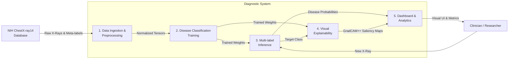
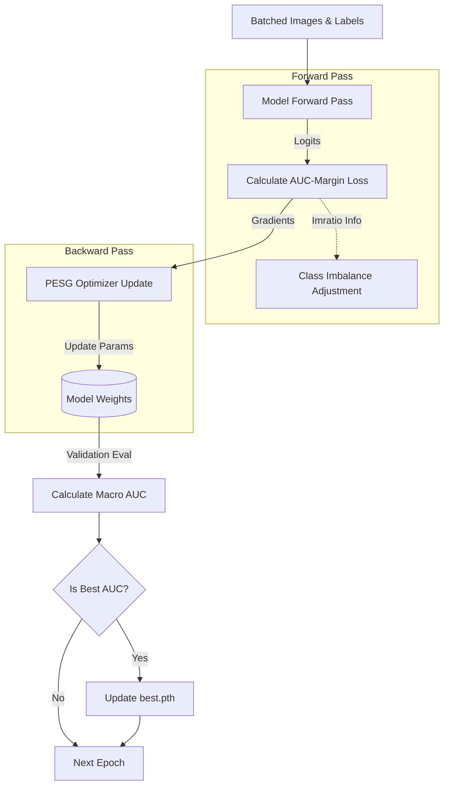
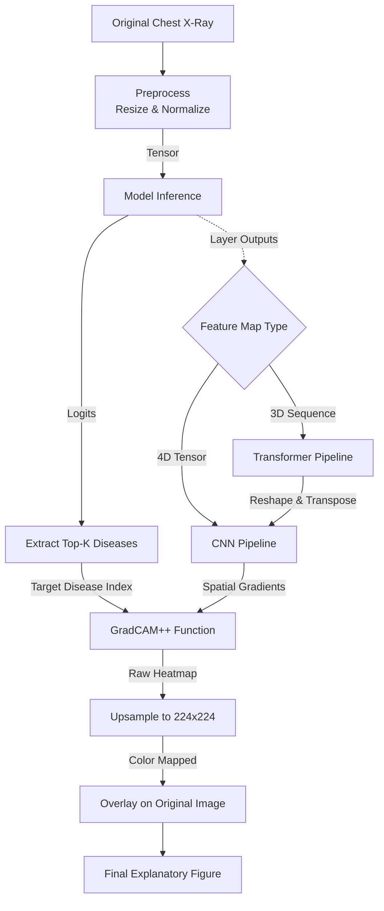
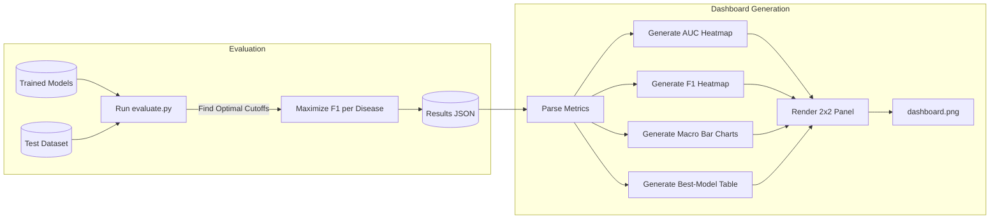

# Multimodal Medical Diagnosis System — Functional Diagrams

Below are the functional diagrams modeled using Mermaid syntax. These describe the functional blocks and data flow of the system, focusing on what the system *does* rather than its internal software class structure.

## 1. Overall System Functional Block Diagram (Level 0 DFD)
This diagram provides a high-level view of the primary functional modules of the diagnostic system and the data exchanged between them.

## 2. Training Optimization Flow (Functional View)
This diagram breaks down the training function, specifically highlighting the AUC-Margin loss and PESG optimizer workflow.

## 3. Explainability Functional Flow (GradCAM++)
This diagram illustrates the functional sequence to generate explainable visual maps from an input image.

## 4. Evaluation and Dashboard Data Flow
This diagram shows how evaluation data is generated and transformed into dashboard visualizations.

