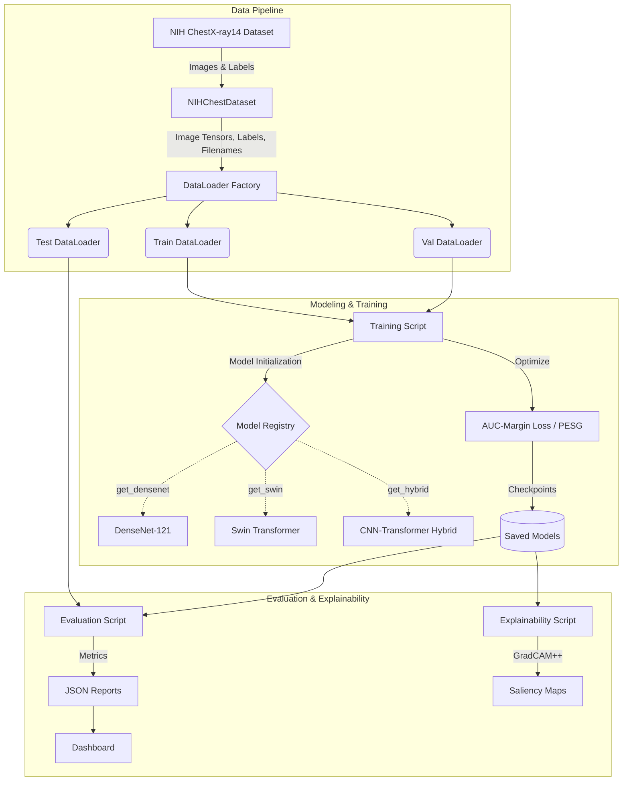
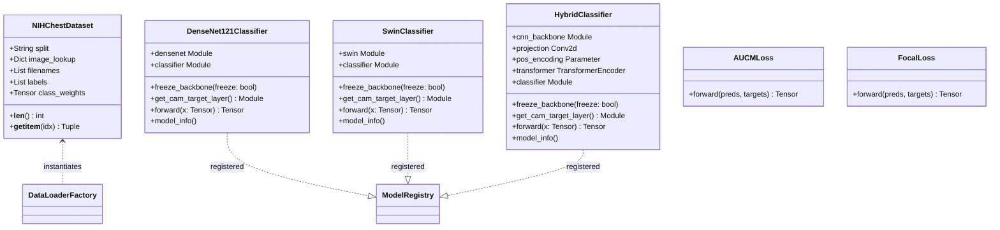
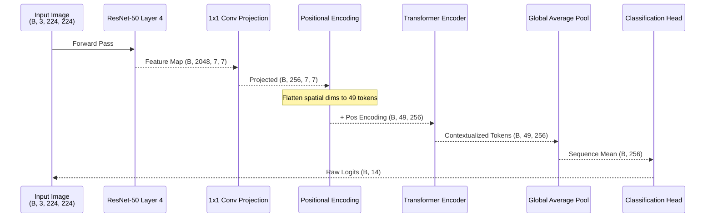
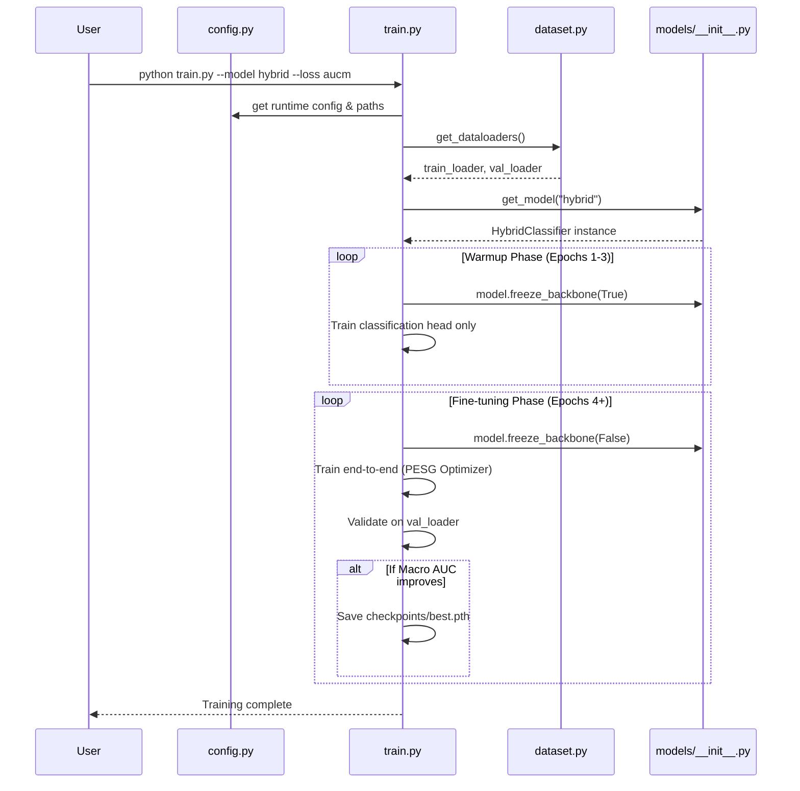

# Multimodal Medical Diagnosis System — UML Diagrams

Below are the requested UML and Architecture diagrams generated using Mermaid syntax. You can include these directly in your Markdown documents, or render them to PNG/SVG using a Mermaid live editor or IDE plugin for your IEEE report.

## 1. System Component Architecture
This diagram illustrates the high-level components and data flow of the system.

## 2. Class Diagram
This diagram outlines the core Python classes and their relationships.

## 3. Hybrid Model Architecture (Activity/Flow)
Since the CNN-Transformer Hybrid is a custom architecture, this sequence/flow diagram details how a single tensor passes through it.

## 4. Training Sequence Diagram
This diagram shows the interactions during the training phase.

